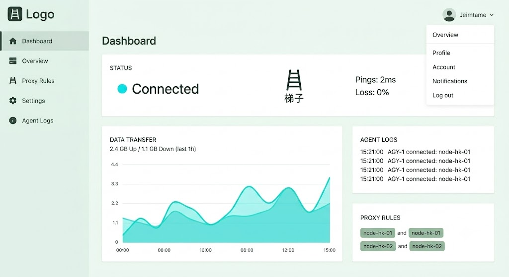

效果图：



基于刚才调整定位的「极简平直 · 极光薄荷」最终版概念图，我为你整理了一份可以直接落地交付的配色与 UI 方案。

整体核心贯彻：**绝对扁平（0 阴影/0 渐变）、锋利直角（0 圆角）、高呼吸感、浅淡底色**。

---

# 🎨 「极光薄荷 3.0」极简平直方案说明书

## 一、 配色方案 (Color Palette)

此版本大幅降低了背景的灰绿浓度，使其更接近带有空气感的浅色，同时用利落的直白色块和锋利的青绿指示灯进行视觉切割。

| 角色 | 颜色名称 | Hex 颜色码 | Tailwind 命名参考 | 视觉与工程用途 |
| --- | --- | --- | --- | --- |
| **全局背景** | 浅空气绿 / Light Air | `#EDF5F2` | `bg-[#edf5f2]` | **全站底色**。比纯白更有极客质感，温和、降温，极度耐看。 |
| **内容容器** | 平板纯白 / Flat White | `#FFFFFF` | `bg-white` | 用于流量图、日志流、节点列表的卡片主体。**直角无阴影**。 |
| **主点缀色** | 极光青绿 / Cyber Mint | `#00D2B4` | `bg-[#00d2b4]` | **全站唯一高亮色**。用于“已连接”状态点、激活的 Switch 开关。 |
| **次点缀色** | 衬托灰绿 / Sage Line | `#7CA197` | `text-[#7ca197]` | 用于次要激活状态（如选中的节点标签）、图表填充线条。 |
| **主文本** | 深苔灰墨 / Moss Ink | `#253532` | `text-[#253532]` | 用于核心代码、终端日志输出、主标题，对比度高且不刺眼。 |
| **次文本** | 雾灰绿 / Mist Green | `#7A8D8A` | `text-[#7a8d8a]` | 用于时间戳、未选中菜单、辅助提示文字。 |

---

## 二、 UI 规范方案 (UI Specifications)

### 1. 结构与层级 (Layout & Elevation)

* **绝对零阴影（Zero Shadow）：** 全站 CSS 严禁出现 `box-shadow`。
* **平直直角（Zero Radius）：** 彻底抛弃 `border-radius: 8px` 或 `rounded-xl`。所有的侧边栏、内容卡片、按钮、下拉菜单，全部采用 **`border-radius: 0px`（Tailwind 中使用 `rounded-none`）**。
* **无线切割（No Borders）：** 白色的内容块（`#FFFFFF`）与浅空气绿底色（`#EDF5F2`）直接硬拼对接，利用色块本身的明度差自然形成边界，不加任何描边线，保持极致的轻量化。

### 2. 核心组件设计示范

#### ❶ 梯子连接状态栏 (Status Panel)

* **容器：** 纯白直角方块 (`#FFFFFF` / `rounded-none`)。
* **左侧：** 一个直径 8px 的纯色圆形指示灯（`#00D2B4`），右侧紧跟文本 `Connected`（`#253532`，加粗）。
* **右侧：** 核心延迟指标，如 `Pings: 2ms`，使用次文本色（`#7A8D8A`），保持视觉克制。

#### ❷ 节点标签 (Proxy Rules / Nodes)

* **未选中状态：** 浅空气绿底色（`#EDF5F2`） + 雾灰绿字（`#7A8D8A`），平直方块。
* **选中状态：** 直接反色。转为衬托灰绿底（`#7CA197`） + 纯白字（`#FFFFFF`），依旧是刚硬的直角，没有任何过渡动画，点击瞬间切换，体现终端工具的“快”。

#### ❸ 终端日志流 (Agent Logs)

* 为了保持全局的“轻盈感”，日志区域不再采用传统的黑底。
* 直接采用纯白底（`#FFFFFF`），左侧时间戳使用浅色（`#7A8D8A`），右侧的程序实时状态（如 `AGY-1 connected: node-hk-01`）使用深苔灰墨（`#253532`），整体呈现出如同实体印刷品般的精致对齐感。

---

## 三、 前端工程配置 (Tailwind CSS Config)

你可以直接将这套配置贴进你的项目中，实现与效果图高度一致的扁平视觉：

```javascript
// tailwind.config.js
module.exports = {
  theme: {
    extend: {
      colors: {
        'air-bg': '#EDF5F2',     // 全局浅空气绿
        'flat-white': '#FFFFFF', // 平板纯白
        'cyber-mint': '#00D2B4', // 极光青绿点缀
        'sage-line': '#7CA197',  // 衬托灰绿
        'moss-ink': '#253532',   // 深苔灰墨字
        'mist-green': '#7A8D8A', // 辅助雾灰绿字
      },
      borderRadius: {
        'none': '0px',           // 强制全站直角
      },
      boxShadow: {
        'none': 'none',          // 强制全站无阴影
      }
    },
  },
  plugins: [],
}

```

### 💡 核心设计心法

这套方案的精髓在于“克制”。因为去除了圆角和阴影这些“现代网页惯用的遮丑修饰”，信息本身的对齐（Alignment）和留白（Whitespace）就成了决定高级感的第一要素。只要保证侧边栏、卡片和文字线条绝对横平竖直、不拥挤，配合这套降温的浅灰绿色彩，网站在 Retina 屏幕上就会展现出一种极其利落、工业风十足的 Agent 终端质感。