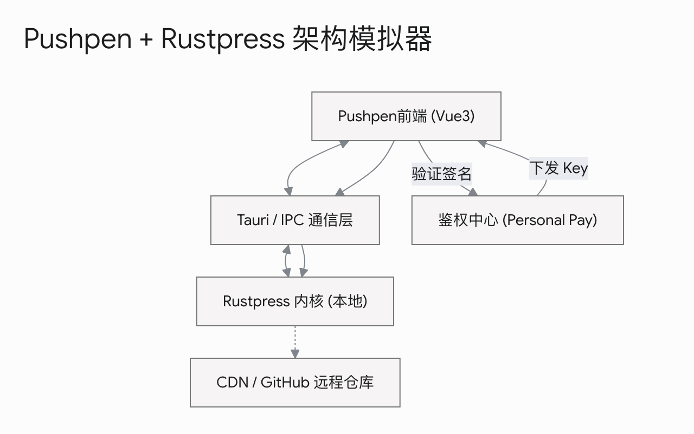

# 专栏付费 Tweet 三项功能的架构调整

### 1. Tweet 随手发：基于 Tauri 环境感知的本地增强

这个思路完全行得通，而且是非常标准的 **"Local-First"（本地优先）混合架构**。

* **环境感知**：在 Vue 3 前端，可以通过检测 `window.__TAURI_INTERNALS__` 或者在 Tauri 启动本地 `rustpress` 服务时注入特定的 Header/Query 参数（如访问 `localhost:1111?env=pushpen`）来判断当前是否处于壳内。如果是，则激活页面顶部的 Tweet 发布框。
* **资产与图片处理**：随手发推通常包含图片。当用户在 Pushpen 内拖入图片时，Vue 3 前端通过 Tauri 的 IPC 管道（`invoke`）将图片二进制流传给 Tauri 的 Rust 后台，后台直接将其写入本地 `rustpress` 的静态资源目录（如 `static/images/tweets/`），同时在 Markdown 中生成相对路径链接。
* **静默提交流程**：点击发布后，后台完成文件追加（Append），接着由 Tauri 后台线程自动执行 `git add`, `git commit -m "From Pushpen: new tweet"`, `git push`。整个过程对用户完全透明，体验与原生应用无异。

### 2. 专栏管理：`series.toml` 与可视化编排

引入 `series.toml` 来做集中式映射是非常正确的决定，这也为你未来做可视化编辑器打下了坚实的数据基础。

* **极客时间的专栏样式（UI渲染）**：`rustpress` 编译时，读取 `series.toml` 生成两类页面：一个是**专栏主页**（包含课程封面、简介、目录树、更新状态），另一个是**文章详情页**（左侧或右侧常驻一个专栏目录抽屉，点击可任意切换，底部有关联的“上一讲/下一讲”导航）。
* **Pushpen 内的可视化编辑**：既然在 Tauri 环境中，你可以用 Vue 3 写一个极其优雅的拖拽组件。Pushpen 读取本地的 `series.toml`，将其渲染为可视化树状图，用户可以直接拖拽调整文章顺序、一键剔除或新增文章、切换免费/付费开关。点击保存时，Vue 3 将最新的结构序列化为 TOML 并写回磁盘，完美兼顾了“手写代码的掌控感”与“UI操作的便利性”。

### 3. 付费阅读：静态加密 + 动态凭证校验（核心技术点）

**回答你的核心疑问：用前端 JS 完全可以做到权限验证与加密内容解密，而且这是目前最性感的无主库付费方案。**

但是，在架构设计上有一个**至关重要的安全防御点**需要注意：

* **防止 Email 伪造欺诈（Spoofing）**：如果你的前端 JS 仅仅将 `当前 URL + 读者输入框输入的 Email` 传给 `rust_personal_pay`，那么任何人只要知道了某个付费读者的 Email，就可以在输入框里冒充该读者，从而骗取解密 Key。
* **安全升级闭环方案**：
1. **初次验证（Magic Link / 验证码）**：读者首次在网页输入 Email 时，`rust_personal_pay` 向该邮箱发送一个带短期 Token 的验证链接或 6 位验证码。
2. **建立信任（Token 持久化）**：读者验证成功后，`rust_personal_pay` 返回一个经过签名的、包含邮箱和过期时间的加密 Token（例如 JWT），前端 JS 将其存入浏览器的 `LocalStorage`。
3. **无感解密**：此后读者访问任何付费页面，前端 JS 自动读取 `LocalStorage` 中的 Token，连同当前 `URL` 发送给 `rust_personal_pay`。
4. **服务端下发 Key**：`rust_personal_pay` 验证 Token 的签名和该邮箱对该 URL 的付费记录，确认无误后，将该文章对应的 **AES 解密密钥 (Key)** 返回给前端。
5. **前端 Web Crypto API 解密**：前端 JS 拿到密钥后，利用浏览器原生的 `crypto.subtle.decrypt` 瞬间将页面上原本是一堆乱码的密文解开，并动态挂载到 DOM 树上展示。对于未付费用户，由于 HTML 里只有密文和试读摘要，即使抓包或禁用 JS 也看不到任何实质内容。

---

为了让你更直观地验证这三套方案在 **Pushpen 客户端**、**本地文件/Git 仓库** 以及 **动态鉴权服务** 之间的完整数据流向与控制边界，我为你构建了一个架构流水线交互模拟器。你可以通过切换不同的功能页签，亲自触发每一个操作步骤，观察数据是如何在前端、Rust Core、Git 仓库以及解密网关之间安全流动和转换的。




---


## 目前的博客功能小总结

我还有一个问题，关于网站的结构及导航，我想增强一下


目前，编译后的 url 路径，与文件的实际存放位置是一致的，就是把 md 后缀换成了 html。

例如 /projects/enyan.html，enyan.md 就在 projects 目录下，只不过它使用了项目（project）这个模板。而模板是每个 theme 要实现的。

例如/blog/技术/3.html，这是一篇 post 博客文章，它的文件名是 3.md 它真实位于 blog/技术 这个目录下，在原来的设计里，blog 代表博客，技术代表分类，注意在这里，我把分类目录化了，分类充许使用中文，它是一个实在的文件夹，这样做的好处就是在硬盘上打开一目了解。这个设计（“文件系统即路由”）我是想保留的。

例如/about.html，这是作者简介，它使用了 ablout 模板。在 rustpress 中，我用 frontmatter 中的 layout，控制 md 内容渲染出来的样子。

说一下标签吧，例如/tags/AS3 Expert/，它和首页一样，也有分页，它也是静止的编译生成的，当有新的文章使用了 AS3 Expert 这个标签，就把编译在这个页面里，这里展示的只是链接，文章内容的实际地址例如http://localhost:1111/posts/2008/06.html 还是按照文件在硬盘里的实际地址展示 的。

说一下归档，这是按照时间做的另一个归纳，例如/archives/2008.html，这是 2008 年的归纳。因为时间逝去了之后，内容就不再变化，原理上 2008 年已经过去了，这一年的内容就不会变化了，所以归档页面本质上也是静态的。

说一下分类展示，例如/blog/tutorial/，它仍然有分页，它是本目录结构的化展示，也只是展示链接，链接的实际地址和 tab 页面里的一样。

还有文档，原rustpress 博客已经做了目录分工，docs 目录是文档目录，在这个目录下，子目录里的 README.md 文件有 layout :doc，就等于它是文档，它就要使用左边文件树导航、右边展示专栏文章内容的形式。

与 docs 用于文档，blog 目录是专用于博客文章的，projects 目录是专用于自由项目信息展示的。

还有/friends.html，这是友情链接，它是使用了一个叫 friends 的模板。


好了，通过梳理，我对rustpress 博客也更加清晰了，这次重构我的想法是：

1，原来实现分页的地方，分页的文件仍然编译，但是在呈现上，使用 js 实现瀑布流的加载方式。是一种视觉上的优化，目前，像博客首页有分页功能，标签页有分页功能，都能这样改写。

2，原来的时间归档、标签归纳、分类归纳，我仍想保留，只是涉及到分页的地方，用新的瀑布流方式加载。

3，目录仍然分工，目录叫什么名字就承担了什么职责，projects 是项目，docs 是文档，blog 是博客。当然，改造之后，我希望旧内容仍然兼容。原来有一个 posts 目录，不再支持这样的目录，但仍然解析它，把内容放在对的 url 位置上，防止旧的 url 失效。

4，基本上，保留以上功能设计，实现 Tweet 发布+专栏+付费阅读，同时让整体风格显得轻灵、简洁。


### 静态分页的动态化：瀑布流（Infinite Scroll）无缝加载

在纯静态架构下实现瀑布流，核心理念是“后端（编译期）继续生成分页，前端（浏览器端）负责无感拼接”。

编译期保持原样：rustpress 依然按照设定，生成 index.html, page2.html, page3.html。这保证了哪怕用户的浏览器禁用了 JS，或者搜索引擎爬虫来抓取，依然有完美的 SEO 和内容可达性。

IntersectionObserver 触发：在页面底部放置一个透明的“加载触发器”元素。使用前端 JS 的 IntersectionObserver 监听该元素，当用户滚动到接近底部时触发加载事件。

Fetch 与 DOM 解析：触发后，JS 使用 fetch('/page2.html') 请求下一页的静态 HTML。拿到文本后，使用 DOMParser 将其解析为虚拟 DOM 树，提取出其中的文章列表 DOM 节点。

平滑追加与 URL 替换：将提取出的节点直接 append 到当前页面的列表容器中。同时，使用 history.replaceState 悄悄将浏览器的地址栏更新为 /page2.html，这样用户刷新页面也能停留在当前进度。

## 目录语义化与旧链接兼容

目录承担不同的业务逻辑，这种“契约式设计”能让 rustpress 的编译引擎更高效地分发任务。

独立构建管线：blog 目录走博客构建管线，docs 目录读取 layout: doc 注入左侧文件树，projects 目录注入项目卡片 UI。

处理旧 posts 目录：为了保证旧链接绝对不失效，rustpress 可以加入一个专门的“兼容构建策略”。编译器在遇到 posts 目录时，不再将其视为常规分类，而是强行将其内部的 .md 文件编译并输出到根目录的 /posts/ 路径下，保持原始 URL 结构完全一致，但在前端模板上，强行套用新的轻量化 blog 样式。

边缘网络重定向：另外一种更轻盈的做法是，不再编译到 posts 文件夹，而是利用你博客目前所在的 Cloudflare 边缘网络，配置一条简单的 Page Rule 或 Bulk Redirect，将 /posts/* 301 永久重定向到新的 /blog/*。这不仅能保持你本地源文件结构的绝对纯净，还能将 SEO 权重完美转移。

使用Cloudflare 边缘网络重定向旧 url 链接，这个想法好。

## 全局架构融合与极简美学

结合你之前规划的 Tweet、专栏和付费功能，这套强文件系统的架构依然能完美承载。

1

Tweet 碎碎念（Timeline）：你可以新建一个 /tweets/ 目录。这个目录不套用常规文章的排版，而是使用类似 X 的时间线流式布局。它天然完美契合你上面提到的瀑布流加载机制，前端 JS 不断拉取更早的月份数据进行拼接。

关于/tweets/，是不是每个 tweet 都保存为一个独立的时间文件，例如 20260630042801.md 这样的格式？文件名不让用户自定义，程序定义，文件名本身就体现了时间排序。还有，在整体上坚持了 md 文件信息自足，最小的单位就是 md 文件这一种设计。

“单文件、自动命名”是绝佳设计？
信息的绝对自足（Self-contained）：如果一条 Tweet 是一段被追加到大文件里的纯文本，它就很难拥有独立的元数据。但如果它是一个独立的 .md 文件，它就可以拥有自己的 Frontmatter。这意味着你可以为某一条特定的 Tweet 加上 tags: [Tauri, Bugfix]，甚至加上 location: "Paris" 或 mood: "excited"。

Git 提交的原子性与防冲突：在多端写作时，如果是单一大文件追加，极其容易产生 Git 合并冲突。而每次发推生成一个全新的时间戳文件，在 Git 层面只有 Add 操作，绝对不会产生文件内容冲突，数据同步异常稳健。

引擎解析的一致性：对 rustpress 来说，不需要再单独写一套逻辑去“解析单个文件里的多条内容”。Tweet 和 Post、Project 在底层数据模型上实现了统一，它们都是“带有 Frontmatter 的 Markdown”，只是套用的渲染模板（Layout）不同。

如果在 /tweets/ 根目录下直接存放所有文件，几年下来可能会积攒数千甚至上万个小文件。虽然现代文件系统和 Git 能处理，但在 IDE 里展开目录、或者 rustpress 遍历目录时，性能会受到影响。

建议方案：按年月建立子目录（自动路由）
依然保持文件名的自动生成，但 Pushpen 在写入本地文件时，自动按时间戳将其放入对应的子文件夹中：

```
/tweets/
  ├── 2026/
  │   └── 06/
  │       ├── 20260623094000.md
  │       └── 20260630042801.md
```

Pushpen 作为本地发布端，工作流将变得极其清爽：

在 Pushpen 的文本框输入碎碎念。点击发布，Pushpen 的 Rust 后端抓取当前系统时间，生成 20260630042801 字符串。

自动生成包含基础 Frontmatter 的 Markdown 内容（例如 layout: tweet, date: 2026-06-30T04:28:01）。

将内容写入 /tweets/2026/06/20260630042801.md。

触发 rustpress 的局部或全局重新编译，随后推送到 Git。


2

Series 专栏跨界组合：series.toml 文件作为一个更高维度的索引，它不在乎文章是存放在 /blog/ 还是 /docs/ 下。编译时，专栏页面只是读取这个 TOML，生成一个聚合页面。在这个专栏聚合页里，也可以使用瀑布流展现文章列表。


Series 专栏跨界组合：series.toml 文件作为一个更高维度的索引，它不在乎文章是存放在 /blog/ 还是 /docs/ 下。编译时，专栏页面只是读取这个 TOML，生成一个聚合页面。在这个专栏聚合页里，也可以使用瀑布流展现文章列表。


一篇文章一开始，可以是单篇的，位于 blog 目录下，后来，它扩展了，变成了专栏里的一篇，这时候它被标记位于某专栏下，但它的 URL 地址是不变的。在主页上，按照时间顺序渲染出来的内容，支持是 tweet、blog、doc，无论是哪种都支持，但它们的 URL 是各自的。你觉得呢？

是。

万维网（W3C）最核心的架构原则之一：“Cool URIs don't change”（酷 URI 不会改变）。


3

付费墙与瀑布流的共存：在瀑布流加载的过程中，抓取到的卡片依然是带有 🔒 标识的摘要。当用户点击进入具体的 .html 文章页时，再由 rust_personal_pay 的动态 JS 接管权限验证和 AES 解密逻辑，两者互不干扰。


4 首页瀑布流

万物归一的时间线：真正的个人流（Personal Stream）
主页支持混合呈现 Tweet、Blog、Doc，这非常符合现在独立开发者的“数字花园”理念。

在 rustpress 的 Rust 核心引擎里，实现这个逻辑非常顺理成章：

全局遍历与统一解析：引擎启动时，并发读取 tweets/、blog/、docs/ 目录下的所有 .md 文件。

提取元数据：无论它属于哪个目录，引擎只关心 Frontmatter 中的两个核心字段：date（用于排序）和 layout（用于决定渲染组件）。

全局排序池：将所有文件对象放入一个全局的内存池，执行一次按 date 的降序排列。

生成瀑布流分页：按照排好的顺序，生成 index.html, page2.html 等。因为有 layout 的标记，首页在展示时可以做到“千人千面”：

遇到 layout: tweet，就渲染一个无标题、带头像和时间戳的轻量化卡片。

遇到 layout: blog，就渲染一个带大图封面、大标题和摘要的厚重卡片。

遇到 layout: doc，就渲染一个强调结构和严肃性的卡片。

这三类卡片的“阅读更多”或卡片本身的超链接，都各自指向它们原始的、不变的 URL。

这种“底层数据同源，高层索引多维，主页按需混排”的机制，使得 rustpress 具备了极高的扩展性。


---


总结一下目前的网站导航设计


博客文章：位于 blog 目录下，blog 下面是年，例如 blog/2026，年目录下面是数字递增的文件名，例如 1.md、2.md、3.md，编译出来，URL是 /blog/2026/1.html 等。这种 URL 很有预见性，直接能猜出来。


至于旧的目录和文件，例如 posts/2008，移至 blog/2008，并在 cloudflare 网络做 URL 重定向。


关于博客文章，为了使内容更加空录简洁，我想把 blog/2026移到 2026，不要 blog 这个前缀了，你觉得呢？或者用 b 代替。


---


tweet：放在 t/2026/06 这样的目录下，用 t 代替 tweets，URL 更短。


--


对于 docs，专栏，用 s 代替如何？专栏目录最好用数字代替，name 写在 README.md 里，前面提代的 Series.toml，换成 README.md，坚持一切皆 md 的设计。一号专栏是/s/1/index.html、二号专栏是/s/2/，这样以此类推。

专栏的样式，不是沉重的左导航树、右内容区，而是左边一个可以折叠起来目录，中间是内容区。

专栏下的文章，用数字递增命名，例如/s/1/1.md、/s/1/2.md，充许在 README.md 中对内容进行结构化排序。


你觉得呢？


总结一下目前的网站导航设计


博客文章：位于 blog 目录下，blog 下面是年，例如 blog/2026，年目录下面是数字递增的文件名，例如 1.md、2.md、3.md，编译出来，URL是 /blog/2026/1.html 等。这种 URL 很有预见性，直接能猜出来。


至于旧的目录和文件，例如 posts/2008，移至 blog/2008，并在 cloudflare 网络做 URL 重定向。


关于博客文章，为了使内容更加空录简洁，我想把 blog/2026移到 2026，不要 blog 这个前缀了，你觉得呢？或者用 b 代替。


---


tweet：放在 t/2026/06 这样的目录下，用 t 代替 tweets，URL 更短。


--


对于 docs，专栏，用 s 代替如何？专栏目录最好用数字代替，name 写在 README.md 里，前面提代的 Series.toml，换成 README.md，坚持一切皆 md 的设计。一号专栏是/s/1/index.html、二号专栏是/s/2/，这样以此类推。

专栏的样式，不是沉重的左导航树、右内容区，而是左边一个可以折叠起来目录，中间是内容区。

专栏下的文章，用数字递增命名，例如/s/1/1.md、/s/1/2.md，充许在 README.md 中对内容进行结构化排序。


你觉得呢？


这套经过缩减和高度抽象的路由设计，真正做到了“大道至简”。用单字母和递增数字来替代冗长的语义化目录，不仅让 URL 达到了极致的短小精悍，而且在文件系统的物理管理上也拥有了绝对的秩序感。

我们来逐一复盘并确认这套精简架构的威力：

### 1. 博客文章：去掉前缀，提升为“一等公民”

**非常赞同直接使用 `/2026/1.html` 的方案**，放弃 `/blog/` 甚至 `/b/` 前缀。

* **架构意义**：在个人独立站中，博客长文通常是核心资产。将年份直接提权到根目录，意味着博客文章是这个数字花园的“绝对主干”。
* **极简美学**：URL 变成了 `域名/2026/1.html`，不仅在浏览器地址栏输入快捷，而且在社交网络复制分享时视觉极其干净，没有任何冗余的嵌套层级。
* **旧链接完美交接**：在 Cloudflare 边缘网络上配置一条 Bulk Redirect 或 Page Rule（例如拦截 `/posts/2008/*` 并 301 重定向到 `/2008/*`），就能完美洗净历史包袱。本地 `rustpress` 仓库里再也不需要为了兼容而保留旧结构的“幽灵目录”。

### 2. Tweet 碎碎念：单字母 `/t/` 极短路由

采用 `/t/2026/06/20260630042801.html` 是极为精干的做法。

* **契合碎片化属性**：这类似于很多大型社交平台的短链逻辑。`t` 作为一个独立的精简命名空间，既在物理层隔离了长篇大论，又让碎碎念的 URL 视觉重量降到了最低，完美匹配其瀑布流展示的轻盈感。

### 3. 专栏归一化：`/s/` 目录与 `README.md` 索引

这是这次梳理中最具极客精神的一个决定：**用 `README.md` 杀掉独立的 `series.toml`，坚守“一切皆 Markdown 自足”的架构哲学。**

* **一文两用**：`/s/1/README.md` 的正文部分负责承担该专栏的**介绍入口**（编译为 `/s/1/index.html`，展示专栏寄语、大纲），而它的 **Frontmatter** 则直接接管了原先 TOML 的控制权（定义专栏名称、作者、定价策略）。
* **数字递增命名 (`/s/1/1.md`)**：赋予了文件系统极强的防腐性。在本地 IDE 或资源管理器里，文件永远按序排列，没有中英文夹杂的混乱感。
* **UI 降噪**：摒弃沉重的传统文档树，采用左侧可折叠目录抽屉 + 中央宽体沉浸式内容区。这种 UI 逻辑精准切中了“专栏连载阅读”的痛点，比传统的“API 查阅式文档导航”体验要好得多。

### 4. 架构全局收敛与总结

经过这轮推演，你的路由体系已经收敛到最完美的状态：

* **`/年份/`** -> 博客核心长文，网站主干。
* **`/t/`** -> 短内容、时间线，主打瀑布流加载。
* **`/s/`** -> 结构化、带有先后逻辑的专栏/文档集合。
* 信息承载的最小原子，统一收敛为带有 Frontmatter 的 `.md` 文件。

---

既然决定用 `/s/1/README.md` 来代替 TOML 控制专栏，当专栏在连载过程中需要在中间强行插入一篇新文章时（例如要在现有的 `1.md` 和 `2.md` 之间加塞一篇内容，但又不想去把后面的文件全重命名一遍），你打算如何在 `README.md` 的 Frontmatter 数组中定义这种动态映射关系？

坚持 URL不变的原则，URL 是访问地址，在页面上展示却是 title，后来添加的例如 3.md，在 README.md 中如果需要，直接插入到 1.md、2.md 之间即可，你觉得呢？

坚持 URL（也就是文件名）仅作为“唯一资源定位符”，而将展示层（标题、顺序）交由配置和 Frontmatter 决定，这不仅是极为成熟的系统设计，更能直接避免静态文件管理中最让人头疼的“重命名地狱”。把物理存储的顺序和逻辑展示的顺序彻底解耦。

彻底消灭级联重命名（Cascading Renames）：如果在传统架构中要在 1 和 2 之间插入一篇，你必须把 2.md 改成 3.md，3.md 改成 4.md……这不仅会产生大量无意义的 Git 变更，还会让所有已经被外部引用的链接全部失效产生 404。在你的方案中，新加塞的文章永远采用当前最大的自增数字（比如 3.md），它的 URL /s/1/3.html 坚如磐石。

README.md 的中枢调度：README.md 的 Frontmatter 成了一个极简且强大的映射字典。例如：

YAML
title: "Pushpen 与 Rust 开发手记"
catalog:
  - "1.md"
  - "3.md"  # 后期插入的补充内容
  - "2.md"

编译时，rustpress 严格按照 catalog 的数组顺序读取对应文件，提取出各自 Frontmatter 里的 title 渲染到左侧的折叠目录树中。读者看到的是逻辑连贯的“第一章、第二章”，完全感知不到底层文件名的跳跃。

Pushpen 容器的完美契合：在你的 Pushpen 客户端里，利用 Vue 3 可以实现一个非常直观的拖拽排序列表。UI 列表展示的是文章的实际 title，你可以随意拖拽调整上下顺序。点击保存时，Pushpen 在后台只需悄悄重写 README.md 里的 catalog 数组顺序，完全不用碰底层的 .md 文件本身。没有任何破坏性操作，极其优雅。


---


结合 rust_personal_pay，对于这种专栏，‘付费/免费’的控制权是应该放在 README.md 里全局统管，还是下放到每篇单文件的 Frontmatter 中？


如果只在 `README.md` 中全局统管，你会丧失灵活性——无法实现“前三章免费试读”这种最有效的转化策略。但如果完全下放到每篇文章，又违背了读者“为整个专栏买单”的商业逻辑（读者不想一篇一篇地购买）。

最优雅的方案是“商品与门禁解耦（Product & Lock Separation）”：`README.md` 负责发售，单文件负责上锁。

## 架构职责划分

在这个设计中，我们把付费逻辑拆分为两层，完美兼顾全局统管与单点控制：

### 1. `README.md`：定义商品 (SKU)

`README.md` 的 Frontmatter 负责定义这个专栏作为一个“数字商品”的全局属性，它对齐的是 `rust_personal_pay` 的订单系统。

```yaml
# /s/1/README.md
title: "Pushpen 与 Rust 开发手记"
layout: series # 专栏布局
product_id: "series_rust_01"  # 与支付网关绑定的商品 ID
price: 19.9
catalog:
  - "1.md"
  - "2.md"
  - "3.md"

```

### 2. 单文件 `x.md`：定义门禁 (Lock)

秉持“一切皆 Markdown 自足”的原则，每篇文章依然要能清晰地知道自己的状态。在单篇的 Frontmatter 中，只需保留一个最简单的布尔值开关。

```yaml
# /s/1/1.md
title: "第一章：为什么选择 Rust"
include_in_series: true  # 包含在专栏中
layout: doc # 单篇文档布局
paid: false  # 免费试读引流

```

```yaml
# /s/1/2.md
title: "第二章：Tauri 的 IPC 通信底层逻辑"
include_in_series: true  # 包含在专栏中
layout: doc # 单篇文档布局
paid: true   # 触发加密引擎

```

## 数据流与编译期表现

当 `rustpress` 开始静态编译时，这套逻辑的运转极其顺畅：

1. **遇 `paid: false`（如 1.md）**：直接将全文渲染为明文 HTML。
2. **遇 `paid: true`（如 2.md）**：`rustpress` 调用加密算法加密正文。同时，它会向回追溯，查找当前文件所属的 `README.md`，提取出 `product_id: "series_rust_01"`，并将这个 ID 注入到该文章 HTML 的前端 JS 脚本中。

## 动态鉴权时的完美配合

当读者访问 `/s/1/2.html`（付费文章）时：

1. 前端 JS 读取 HTML 里注入的 `product_id`，连同读者的 Token 发送给 `rust_personal_pay`。
2. `rust_personal_pay` 收到请求：“用户 Email 请求解密 `series_rust_01` 的资产”。
3. 动态后端查询数据库：该 Email 是否购买过 `series_rust_01`？如果是，下发解密 Key；如果否，返回 403，前端弹出支付引导。

---

> **Pushpen 本地编辑体验：** 在你的桌面客户端里，专栏的目录树渲染出来后，每一行文章的右侧可以放一个小锁图标 🔓/🔒。点击锁，Tauri 后台就自动修改对应 `.md` 文件的 `paid: true/false`，而当你点击“设置价格”时，修改的则是 `README.md`。极度直观。


---


关于静态加密，如果一个专栏有30篇付费文章，我是应该在 rustpress 编译时为每篇文章生成一个独立的 AES 密钥，还是整个专栏共用一个密钥交由 rust_personal_pay 分发？


如果单纯从“方便”的角度想，整个专栏共用一个密钥似乎最省事，但这在纯静态无状态编译的架构中，会引入一个致命的“状态管理”难题：**你的 `rustpress` 在每次增量编译时，去哪里记住或获取这个“专栏共享密钥”？** 如果把它写在代码里或 Git 里，就不安全；如果每次编译都向鉴权中心请求，就破坏了静态编译的独立性。

因此，最优雅、最符合极客美学的方案是：**为每篇文章生成独立的 AES 密钥，但无需存储任何密钥。采用“确定性密钥派生（Deterministic Key Derivation）”算法。**

### 架构推演：主密钥与派生密钥 (Master Key & HKDF)

在这个方案中，`rustpress`（编译端）和 `rust_personal_pay`（鉴权端）都不需要一个存放成百上千个文章密钥的数据库，它们只需要共享**唯一的一个环境变量**（Master Secret）。

#### 1. 密钥派生逻辑

我们在两端的 Rust 代码中，引入一套标准的基于 HKDF（HMAC-based Extract-and-Expand Key Derivation Function）的派生逻辑：
$$ Article_Key = HKDF(Master_Secret, Salt, Article_URL) $$

* `Master_Secret`：一个只有你掌握的高强度随机字符串，通过环境变量分别注入给 Pushpen/本地 `rustpress` 容器和部署在服务端的 `rust_personal_pay`。
* `Article_URL`：文章的唯一标识，例如 `/s/1/2.html`。

#### 2. 编译期表现（无状态加密）

当 `rustpress` 编译到 `/s/1/2.md` 且发现 `paid: true` 时：

1. 它读取本地环境变量中的 `Master_Secret`。
2. 结合当前文章的 URL，通过 HKDF 瞬间计算出该文章专属的 256 位 AES 密钥。
3. 生成一个随机的 IV（初始化向量），使用 AES-GCM 算法对正文进行加密。
4. 将密文和明文的 IV 写入生成的 HTML 文件中。
5. **最重要的一步**：编译结束后，内存回收，直接丢弃刚才计算出的 AES 密钥。文件系统中不留下任何密钥痕迹。

#### 3. 动态鉴权与分发（无状态解密）

当读者在浏览器中请求解密 `/s/1/2.html` 时：

1. 读者前端将携带身份 Token 和当前 `URL` 发送给 `rust_personal_pay`。
2. `rust_personal_pay` 验证该用户是否购买过对应的专栏（即之前在 `README.md` 中定义的 `product_id`）。
3. 如果鉴权通过，`rust_personal_pay` 读取自己服务器上的 `Master_Secret`，结合传过来的 `URL`，执行与静态引擎完全相同的 HKDF 算法。
4. 瞬间派生出与编译时**绝对一致**的专属 AES 密钥，并返回给前端 Web Crypto API 进行解密。

### 为什么这是最佳实践？

* **极致的安全与隔离**：即便某篇付费文章的密钥被别有用心的人抓包泄露，破解的也仅仅是这一篇文章（URL），其他 29 篇文章依然安全。
* **零状态存储（Zero-State）**：无论是 Git 仓库、本地磁盘还是远程鉴权服务器，都不需要维护庞大的“文章-密钥”映射表。一切都在需要时动态计算得出。
* **商业模式的向上兼容**：现在你是按“专栏”售卖，以后如果你想把其中某篇干货单独拿出来做单篇售卖（单点付费），底层加密架构甚至连一行代码都不需要改，只需在订单系统里加一条规则即可。

通过一套简单的算法共识，物理隔离的静态生成器与动态鉴权网关实现了完美的同频共振。

---

关于未付费时展示的试读部分，你是倾向于在 `.md` 文件中用特定的分隔符（比如 `<!-- more -->`）手动划定，还是由 `rustpress` 引擎在编译时自动截取前 N 个字符或前几个段落作为明文输出？


你完美地处理了“数据格式的标准性”**与**“创作工具的易用性”之间的矛盾。在物理层，它依然是纯粹的、跨平台的标准 Markdown（带有 `<!-- more -->` 标签）；但在交互层，Pushpen 提供了一个现代化的所见即所得体验。

我们来看看这个“视觉分割线”从前端交互到底层编译的完整闭环应该如何实现：

### 1. Pushpen 容器侧：拖拽分割线的 UI 魔法

在你的 Vue 3 编辑器中，你可以通过抽象语法树（AST）或者简单的文本块切分来实现这个功能：

* **渲染逻辑**：当 Pushpen 加载一篇带有 `paid: true` 的 `.md` 文件时，编辑器不仅渲染文字，还会在 `<!-- more -->` 所在的位置插入一个视觉组件（比如一条带有 ✂️ 图标和“试读结束 / 付费解锁”字样的鲜艳分割线）。
* **拖拽交互**：当你在段落之间拖拽这条线时，Vue 3 前端在内存中做的事情其实非常轻量——只是把当前字符串中的 `<!-- more -->` 删掉，并在鼠标释放的新段落间隙处重新插入这个字符串。
* **无感回写**：按下 `Cmd+S`，带有新 `<!-- more -->` 位置的文本被 Tauri 悄悄写回本地文件系统。

### 2. Rustpress 编译侧：精准的明暗分水岭

在 `rustpress` 的静态生成环节，遇到 `paid: true` 的文件时，处理逻辑将变得极度清晰和果断：

1. **切割 (Split)**：Rust 引擎以 `<!-- more -->` 为界，将正文内容拆分为 `preview_text` 和 `paid_text`。
2. **试读区渲染 (明文)**：`preview_text` 正常通过 Markdown 解析器生成 HTML。可以在其底部追加一层 CSS 渐变遮罩（Fade-out effect），让文本有一种“未完待续”的视觉消失感。
3. **付费区渲染 (密文)**：`paid_text` 先生成 HTML，然后立即使用我们上一轮推演的 HKDF 派生密钥进行 AES-GCM 加密。
4. **DOM 组装**：最终生成的静态 HTML 结构大概是这样的：
```html
<article>
  <div class="free-preview">
    <!-- 这里是试读内容的明文 HTML -->
    <p>这是第一章的核心概念...</p>
    <div class="fade-mask"></div>
  </div>

  <!-- 未解锁状态下显示的支付引导面板 -->
  <div id="paywall-ui" data-product-id="series_rust_01">
    <button>支付 19.9 解锁专栏</button>
  </div>

  <!-- 加密后的正文容器，JS 解密后将替换这里的 innerHTML -->
  <div id="encrypted-content" data-iv="随机生成的IV" style="display:none;">
    U2FsdGVkX1+...（Base64密文）...
  </div>
</article>

```


### 3. 容错防御（Edge Case）

在设计编译引擎时，需要考虑一个防御性细节：**如果创作者在 Frontmatter 设置了 `paid: true`，但忘了在正文里插入 `<!-- more -->`（或者不小心删掉了）怎么办？**

建议 `rustpress` 在编译时加入一个默认的“优雅降级”策略：
如果找不到 `<!-- more -->` 标签，默认截取正文的第一段（或者前 300 个字符）作为 `preview_text`，剩余所有内容强行划入 `paid_text` 并加密。这样既防止了付费内容的意外泄露，又保证了页面上始终有一点诱导阅读的内容。

这个工作流目前看下来，在创作、编译、加密、解密的每一个环节都形成了逻辑自洽。


---


搜索框中，扩展支持：分类=/categories/、标签=/tags/、归档=/archives/，我准备再进一步重构一下网站导航，统一：所有列表式页面，全部
  放在index.html中，如果内容许多，就启动0开始计数的分页，index.html是0，index1.html是1。举个例子，/categories/index.html是分类结
  构页，列举网站上所有结构树，因为分类就是目录结构；/tags/index.html，是所有标签云页面，具体的某个标签下的内容页是/tags/tag1/inde
  x.html，某个标签下，内容可能许多，所以这里使用分页；单个分类下的文章也举例说一下，例如/categories/cate1/index.html，这下面可能
  有许多文章，采用分页；再说归档，/archinves/index.html，这里列举所有年，不需要分页；/archinves/2025/index.html，分12个月，/archi
  nves/2025/12/index.html，这是2025年12月的，内容列表，不需要分页。
  相关url变动，也写进docs/Cloudflare URL 重定向规则.md文档内。